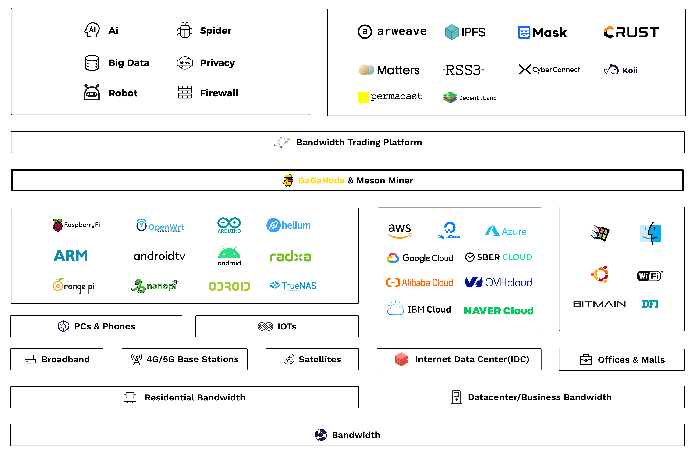

# Introduction

## What GaGanode Is

GaGaNode, the Next generation Decentralized Residential IP + Bandwidth marketplace, aims to alleviate the global shortage of IPv4 addresses with Web3.0 technology.

GaGaNode is developed for helping users to master idle home bandwidth resources independently. Users can participate in Web3 network through Idle Electronics at home without public network IP. GaGaNode encourages everyone to reduce investment in new mining equipment and install GaGaNode on any Idle Electronics such as Raspberry Pi, Android phone, Arm SBC, TV Box, Xbox, Playstation and other electronic devices through software porting as much as possible.

At the moment when the global IPv4 address resources are in short supply, those Future technologies that need to rely on home bandwidth resources to develop can obtain real home bandwidth resources through GaGaNode, thus changing the status quo that home bandwidth resources need to be purchased from hacker channels, making related services more and more trendy. for compliance.

## What Meson Network Is

Meson Network is committed to creating an efficient bandwidth marketplace on Web3, using a blockchain protocol model to replace the traditional labor-based sales models, consolidating and monetizing idle bandwidth from long-tail users at a low cost. Meson Network is the foundation of data transmission for decentralized storage, computation, and the emerging Web3 Dapp ecosystem.

## How GaGaNode Works

## Social Media

We have an active and growing community. All are welcome to be part of our community, help shape it, or simply observe.

At any point, feel free to join our [Telegram group](https://t.me/mesonnetwork) and [Discord server](https://discord.gg/invite/z6YfSHDkmS). The #gaganode channel is most relevant GaGaNode.

Join in the [🦄 Meson BUILDer Program](https://forms.gle/xEavrpdo8j4Mwh2XA).

We also use [GitHub](https://github.com/daqnext) Issues and Discussions.

Or you can follow [Twitter](https://twitter.com/NetworkMeson) and [Medium](https://medium.com/meson-network) for updates.

   