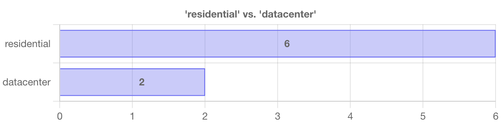
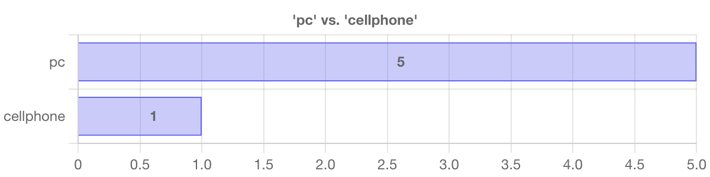
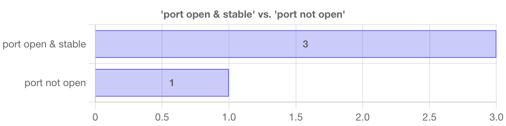
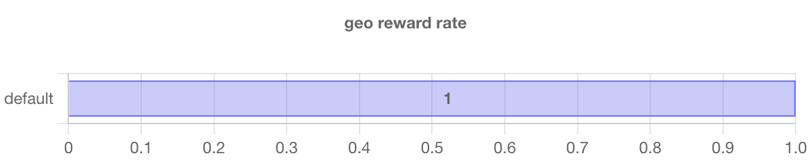
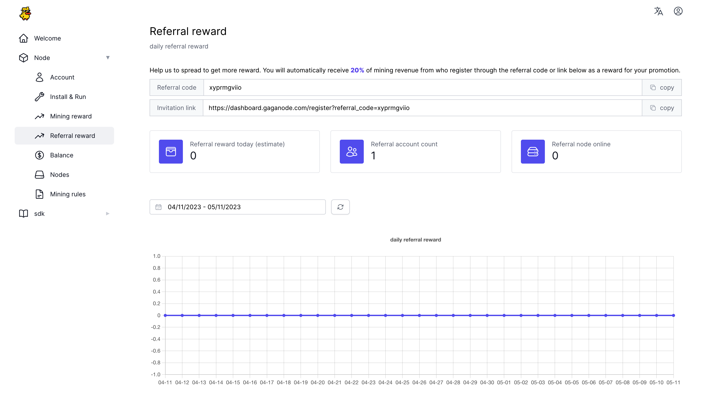
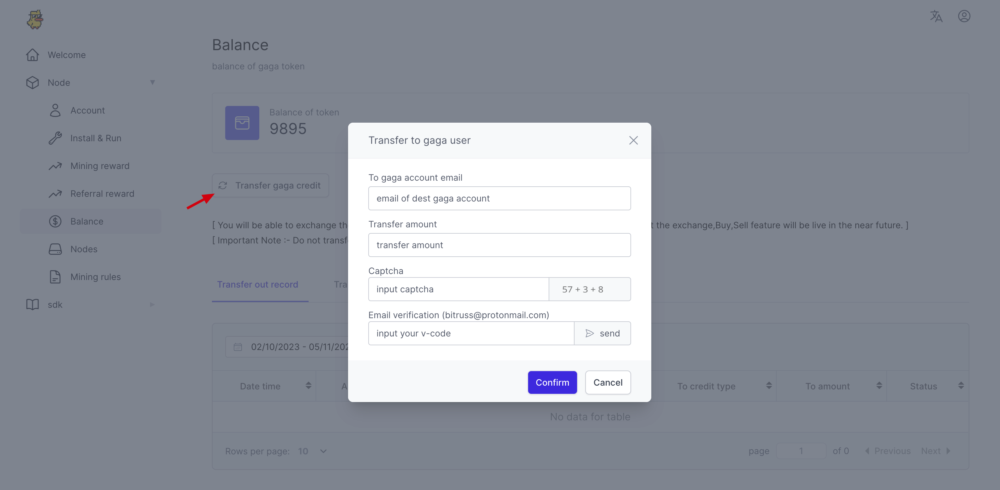

# 🦆 GaGaNode Credit

>GaGaNode supports joint mining with Meson Network, and GaGaNode Credits will be mapped into a certain proportion of the Meson main net.

GaGaNode follows the Tokenomics of Meson Network with a blockchain protocol model to replace the traditional labor-based sales models and consolidate and monetize idle Residential bandwidth resources from long-tail users at a low cost.

To get GaGaNode Credits, enthusiasts only need an idle Android phone, such as tvbox, Raspberry Pi, pc, and other electronic devices. Users do not need additional mining machine investment, they can contribute home bandwidth resources to obtain GaGaNode Credits.

## Mining Reward

Node will be rewarded with gaga credit every round which takes about 10-30 minutes.

The reward amount differs among various countries.

Reward is higher for nodes that have residential ip then nodes that have datacenter ip.

Please check [miningrules](https://dashboard.gaganode.com/mining_rules) for details.

*port open & stable : node with public ip , port open and stable online

Node will be rewarded with gaga credit every round which takes about 10-30 minutes.

Node reward depends on the chart above.

*example: node[residential],[pc],[port not open] => base reward = 6 * 5 * 1

The (geo reward efficiency) will be 1.0 as default value if not listed above

*final reward = base reward * (geo reward efficiency)

## Referral System

Help us to spread, and you will also get benefits. You will automatically receive **20%** of mining revenue from who register through the referral code or link below as a reward for your promotion.

Please check [Referral reward](https://dashboard.gaganode.com/referral_reward) for details.

## Transfer

Click `Balance`, and check out the `Transfer Record`.

Click `Transfer gaga credit`, and perform Credit Transfer operations.

Please check [Balance](https://dashboard.gaganode.com/credit_balance) for details.

