# MSN to SepoliaETH

>Explore and test the latest features of the MSN as it goes live on the SepoliaETH Testnet, signaling the commencement of a new testing phase. Upgrade to the Sepolia TestNet, and take the opportunity to remap and recover your expired and lost tokens, contributing to the ongoing efforts to enhance and refine the overall MSN experience. Join us in this exciting phase of development!

[[toc]]

## Request Sepolia ETH

If you don't have Sepolia ETH, you need to request Sepolia ETH through the Sepolia ETH faucet.

Sepolia ETH can be obtained through faucet websites such as the [Ethereum Sepolia Faucet](https://sepoliafaucet.com/) or the [Sepolia PoW Faucet](https://sepolia-faucet.pk910.de/).

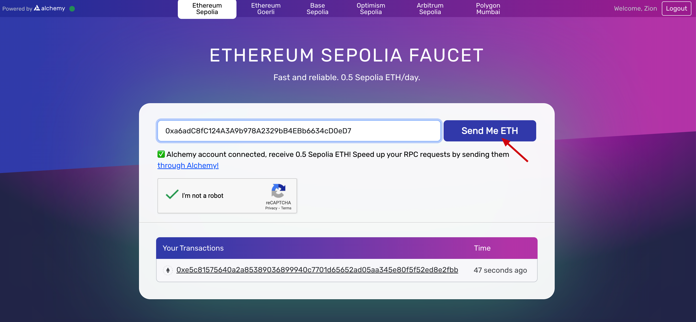

## Connect Wallet

Click on the link [https://dashboard.gaganode.com/claim/mining_claim/gaga_credit_balance/sepolia](https://dashboard.gaganode.com/claim/mining_claim/gaga_credit_balance/sepolia) to access the MSN Reward and Token page.

Click `Connect Wallet` to initiate the process of connecting with your wallet.

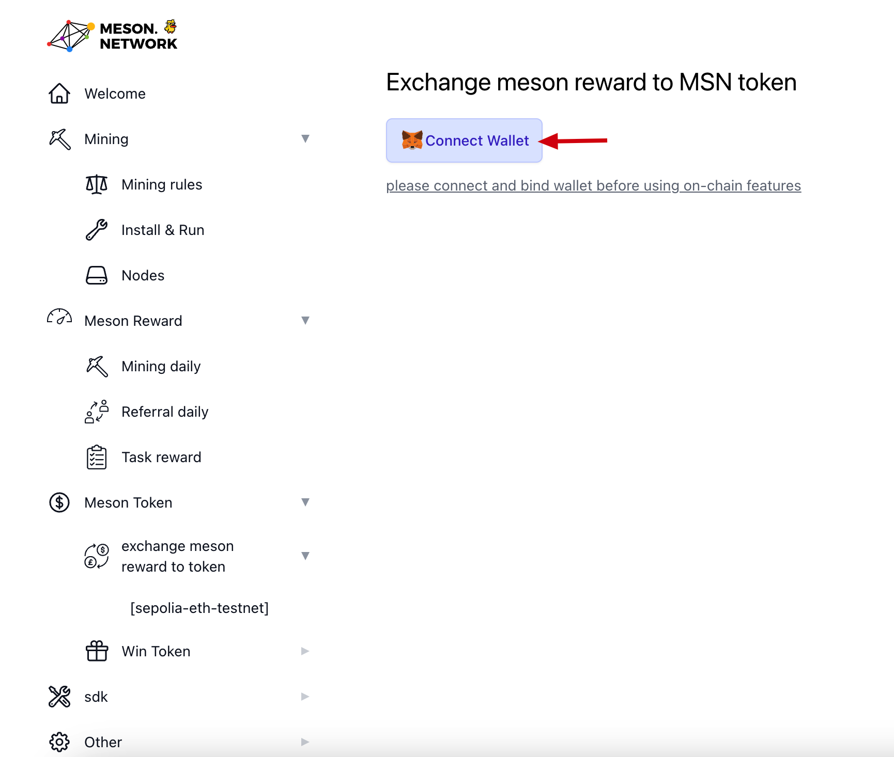

Select your Sepolia account for login and confirm the connection.

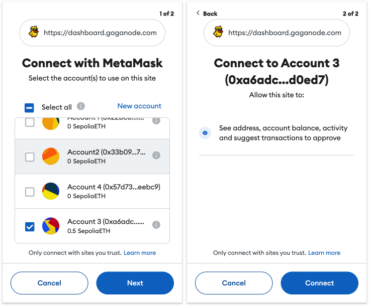

Click `Bind Wallet`.

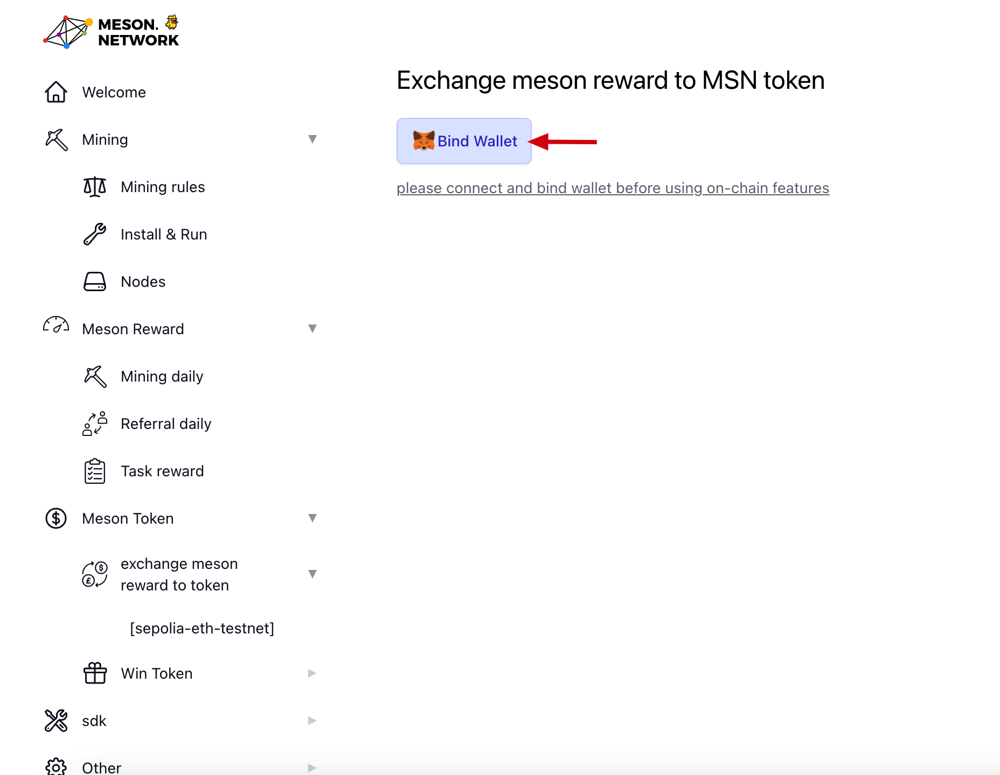

Confirm whether to bind the wallet.

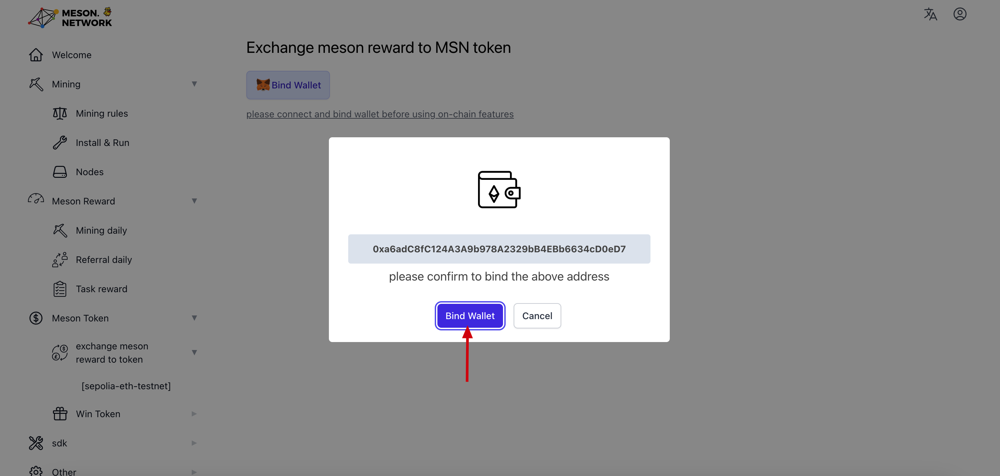

## Exchange meson reward to MSN token

Click the `Exchange` button.

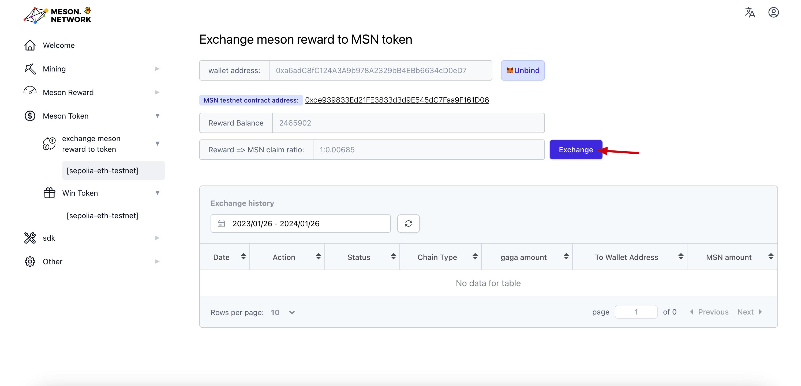

Complete the `Choose a chain` step, currently selecting SepoliaETH.
sepolia
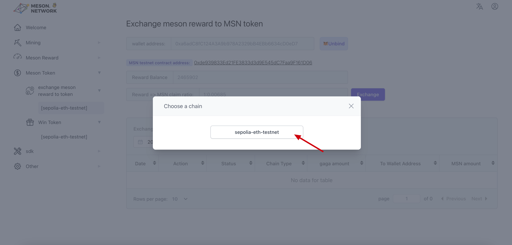

Enter the amount of MSN Tokens to be claimed on SepoliaETH.

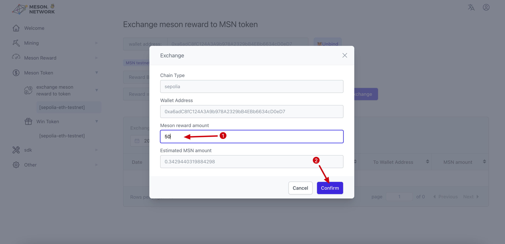

```
Amount: Enter the amount you wish to claim. You have the option to claim the entire amount or only a portion of it.
```

Complete the confirmation to transfer MSN to SepoliaETH.

::: tip 🚧 TIP
Your meson reward balance will be transferred to the MSN on sepolia-eth-testnet, and this operation cannot be undone, please confirm.
:::

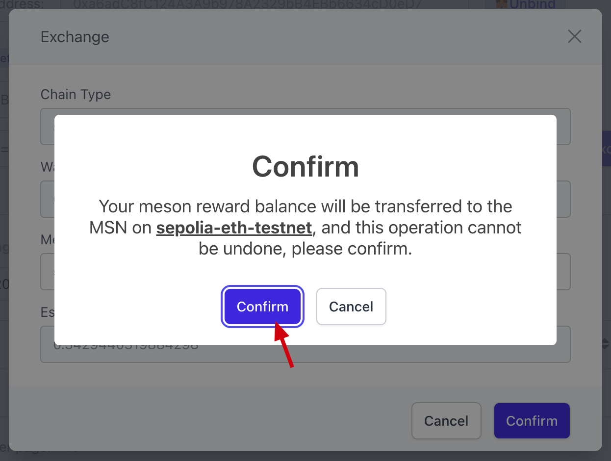

Click the `Get Token` button.

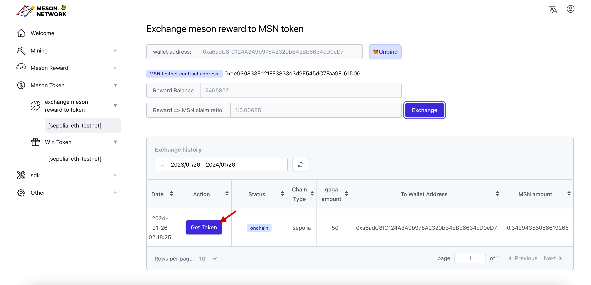

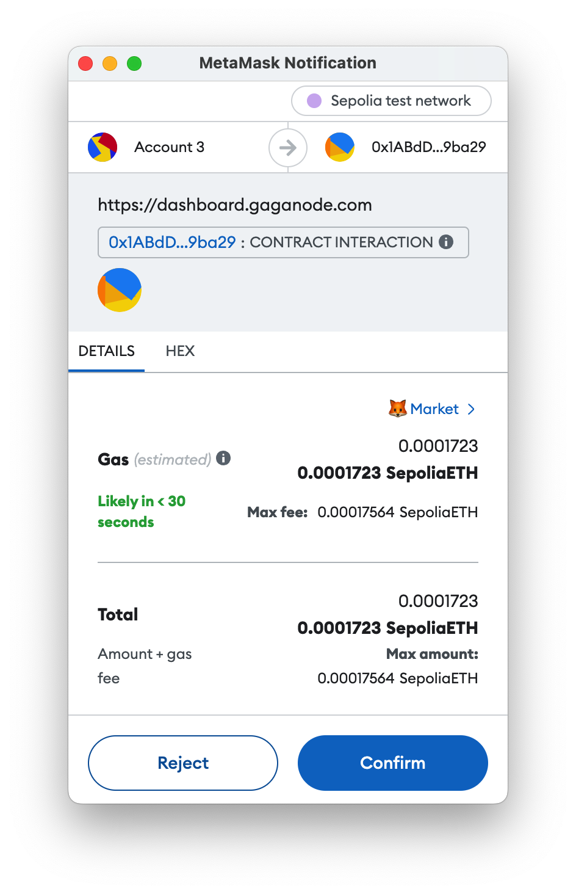

You have now successfully claimed MSN on SepoliaETH.

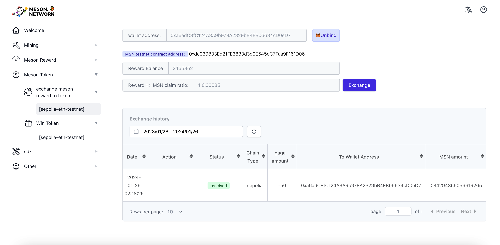

This is the link to my completed transaction on the Sepolia Testnet: [0x04e78181a67e3726fc8e7572ae2c3ebbec7980c0ba898d82da1a17e0e93a0028](https://sepolia.etherscan.io/tx/0x04e78181a67e3726fc8e7572ae2c3ebbec7980c0ba898d82da1a17e0e93a0028)

## Import tokens

The smart contract address for MSN on the Sepolia network: [0xde939833Ed21FE3833d3d9E545dC7Faa9F161D06](https://sepolia.etherscan.io/token/0xde939833Ed21FE3833d3d9E545dC7Faa9F161D06)

Enter the Token contract address as `0xde939833Ed21FE3833d3d9E545dC7Faa9F161D06` and click `Confirm`.

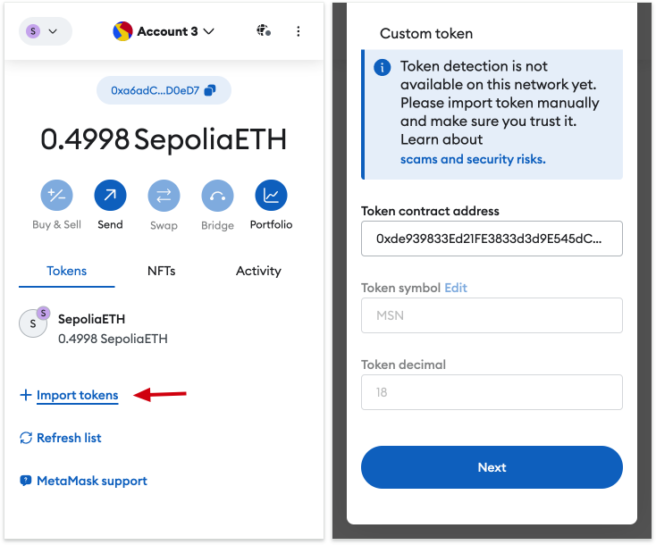

Click `Import`, and you'll be able to view the claimed MSN in MetaMask.

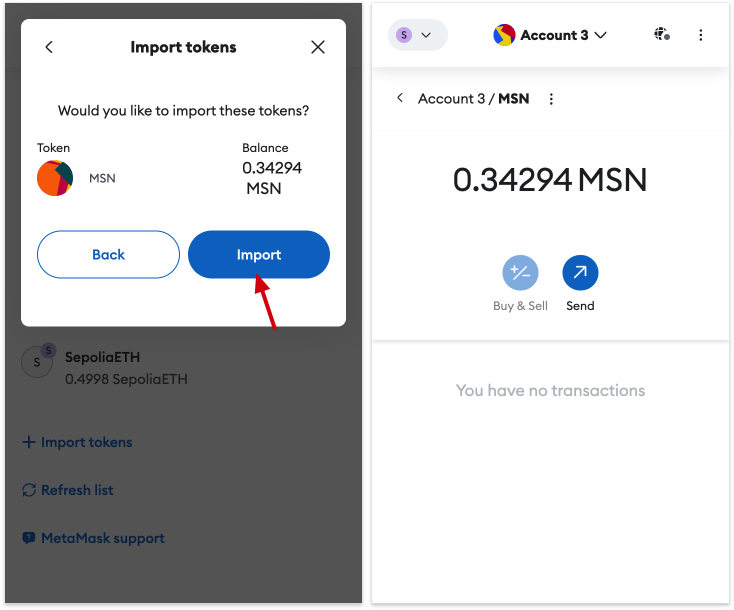