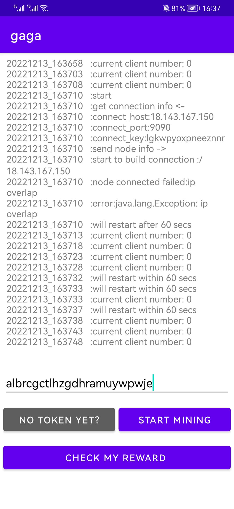
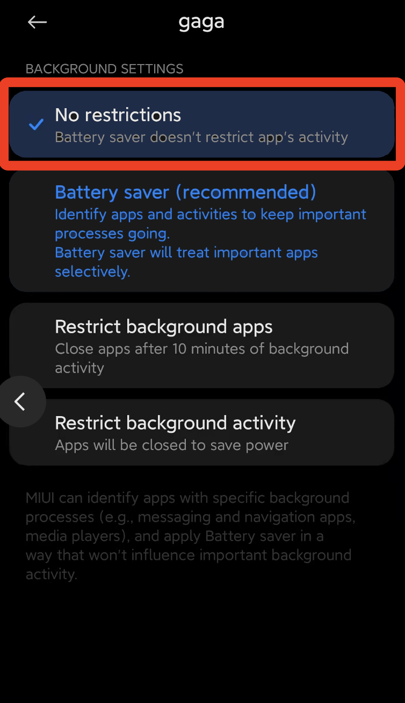
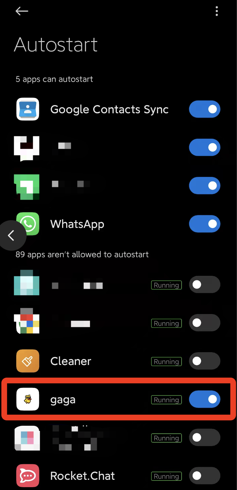

# How To Run GaGa On Android

>How to easily install a GaGaNode on Android.

[[toc]]

::: tip 🚧 TIP
- The minimum recommended version is **Android 4**.
- Enable Auto-starting GaGaNode APP in Android.
:::

## Register

[https://dashboard.gaganode.com/register](https://dashboard.gaganode.com/register)

## Download & Install

Android APK Download: [gaganode-1_0_3.apk](https://assets.coreservice.io/public/package/32/gaganode/1.0.3/gaganode-1_0_3.apk)

## Start Service

Click the button “[Install & Run](https://dashboard.gaganode.com/install_run)” and you can find out your token and installation tutorial in this page.

 

Input You Token, Click `Start Mining`.

## Enable Auto-starting
 

Set 'No restrictions' when start.

Enable Autostart.

