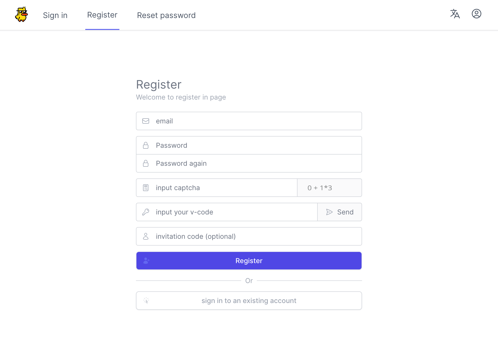
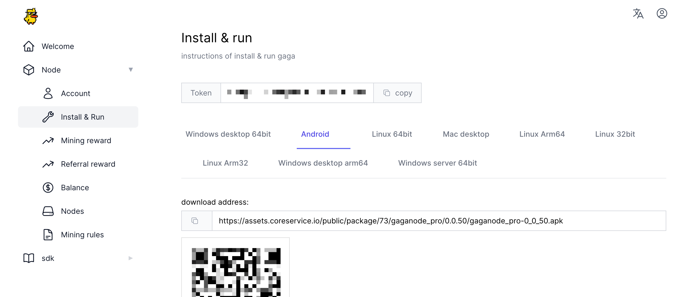
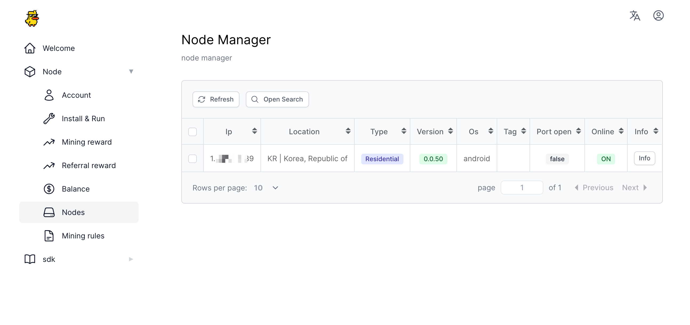
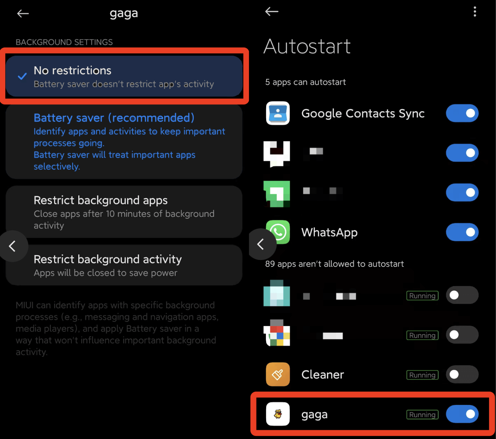

# How To Run GaGa On Android

>How to easily install a GaGaNode on Android.

[[toc]]

::: tip 🚧 TIP
- The minimum recommended version is **Android 4**.
- Enable Auto-starting GaGaNode APP in Android.
- The Android device is unable to connect to Gaganode using the Datacenter IP.
:::

## Register

[https://dashboard.gaganode.com/register](https://dashboard.gaganode.com/register)

## Download & Install

Android APK Download: [gaganode_pro-0_0_66.apk](https://assets.coreservice.io/public/package/73/gaganode_pro/0.0.66/gaganode_pro-0_0_66.apk)

GaGa Android GitHub: [https://github.com/gaganode/gaga_android/releases](https://github.com/gaganode/gaga_android/releases)

## Start Service

Click the button “[Install & Run](https://dashboard.gaganode.com/install_run)” and you can find out your token and installation tutorial in this page.

 

Input `You Token`, Click `Start Mining`.

After 1-3 minutes, you will have a new terminal record at terminals open in new node .

## Enable Auto-starting

Set 'No restrictions' when start. Enable Autostart.

