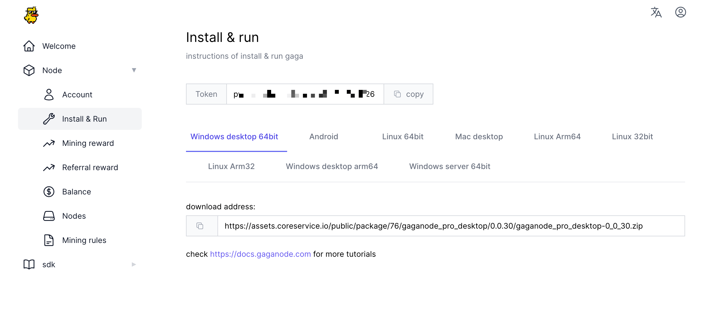
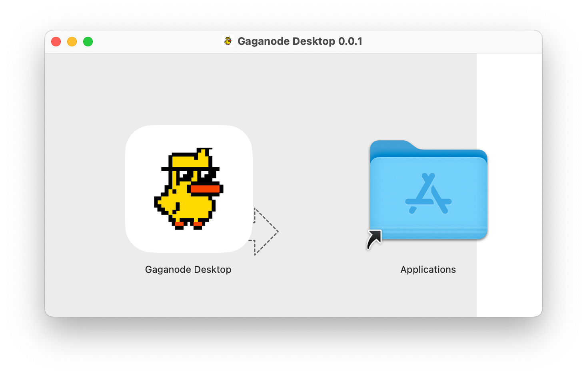
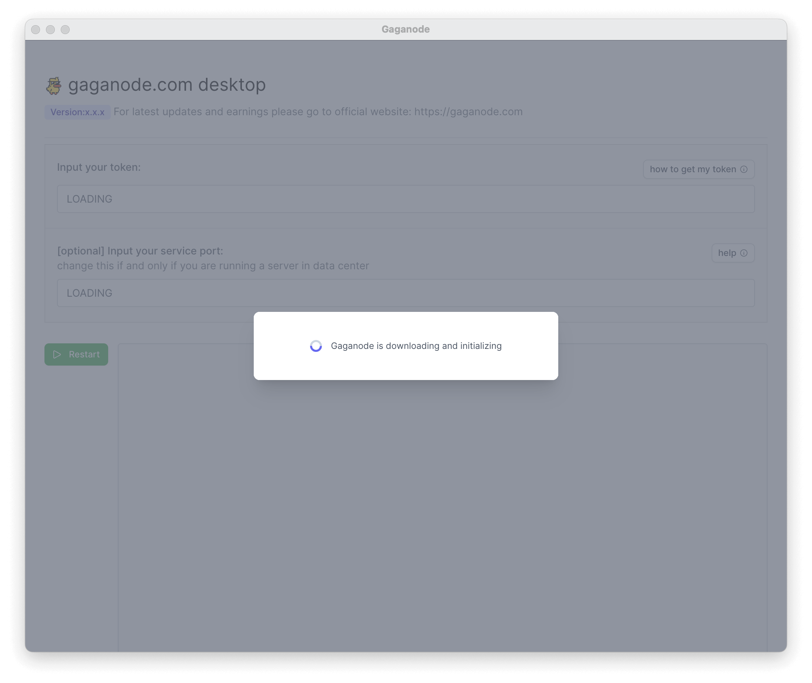
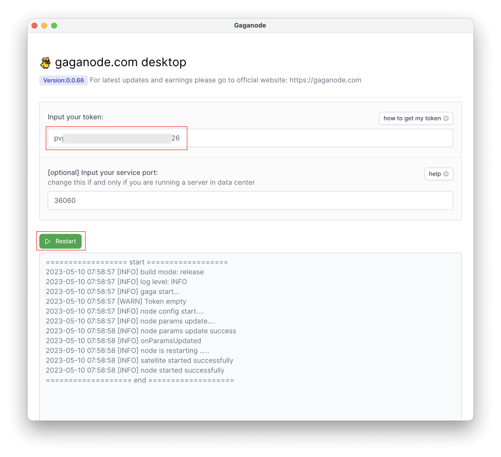
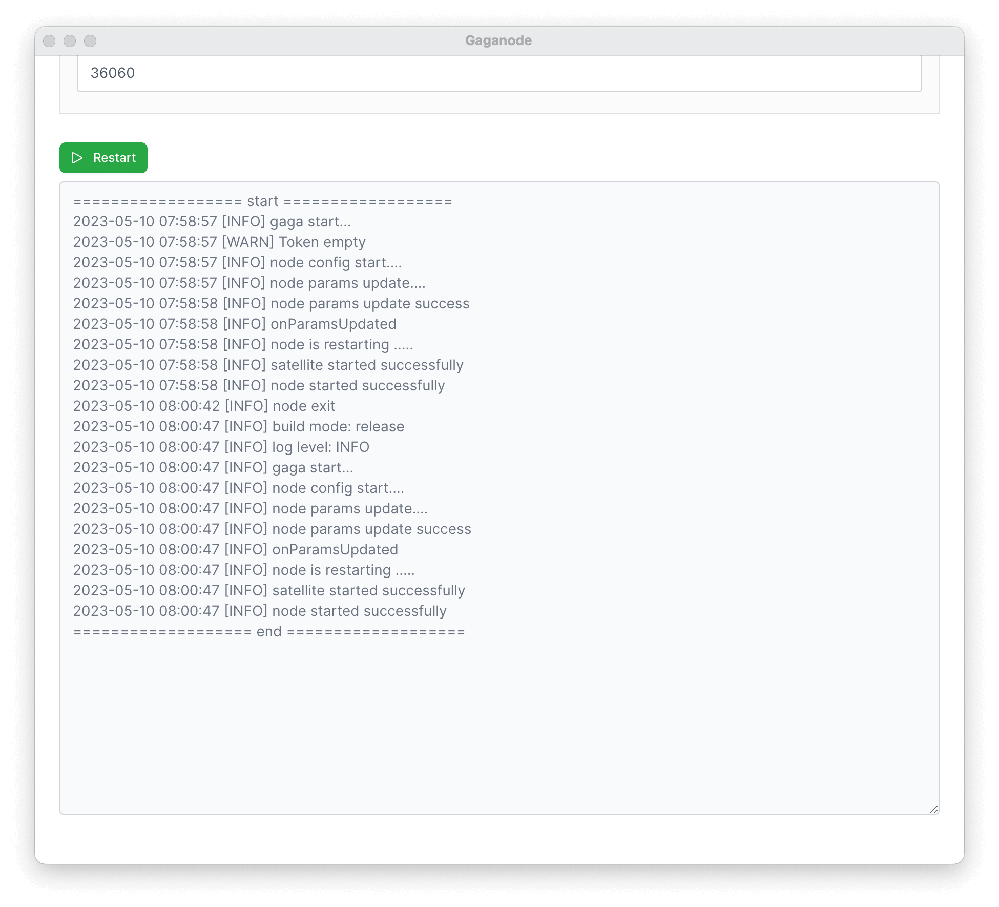
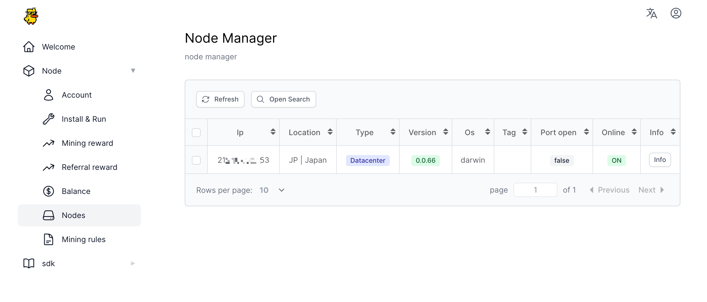

# Run GaGa On MacOS Desktop

>How to easily install a GaGaNode on MacOS Desktop

[[toc]]

## 1.Download

You can obtain your token and installation package by clicking the "[Install & Run](https://dashboard.gaganode.com/install_run)" on this page.

## 2.Install 

The GaGaNode Desktop for macOS version can be easily installed by simply opening the `.dmg` installation package.

Clicking on the GaGaNode Desktop icon will launch the application.

## 3.Start Service

When you open GaGaNode Desktop, it will first initiate a download process for initialization, which may take anywhere between 1-3 minutes to complete.

Once the download is complete, enter your Gaganode token and click on the "Restart" to initiate the restart process.

After waiting for the restart process to complete, you will notice that Gaganode has been successfully launched.

After 1-3 minutes, you will have a new terminal record at terminals open in new node .

