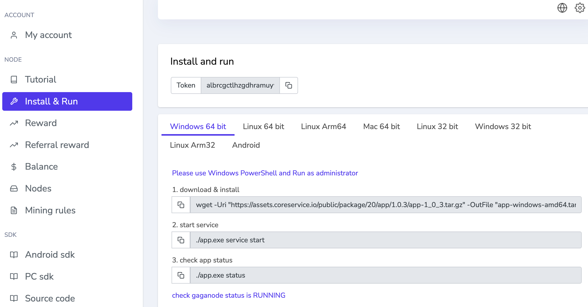

# How To Run GaGa On MacOS

>How to easily install a GaGaNode on MacOS.

[[toc]]

## Register

[https://dashboard.gaganode.com/register](https://dashboard.gaganode.com/register)


Click the button “[Install & Run](https://dashboard.gaganode.com/install_run)” and you can find out your token and installation tutorial in this page.



## 1.Download & Install

In the Terminal app  on [your Mac](https://support.apple.com/guide/terminal/welcome/2.13/mac), do one of the following:

```bash
curl -o app-darwin-amd64.tar.gz https://assets.coreservice.io/public/package/18/app/1.0.3/app-1_0_3.tar.gz && tar -zxf app-darwin-amd64.tar.gz && rm -f app-darwin-amd64.tar.gz && cd ./app-darwin-amd64 && ./app service install
```

console output:

```bash
gaga-mac curl -o app-darwin-amd64.tar.gz https://assets.coreservice.io/public/package/18/app/1.0.3/app-1_0_3.tar.gz && tar -zxf app-darwin-amd64.tar.gz && rm -f app-darwin-amd64.tar.gz && cd ./app-darwin-amd64 && ./app service install
  % Total    % Received % Xferd  Average Speed   Time    Time     Time  Current
                                 Dload  Upload   Total   Spent    Left  Speed
100 8161k  100 8161k    0     0  3053k      0  0:00:02  0:00:02 --:--:-- 3061k
Install app service:					[  OK  ]
```

## 2.Start Service

```bash
./app service start
```

console output:

```bash
➜  app-darwin-amd64 ./app service start
Starting app service:					[  OK  ]
```

## 3.Check APP Status

```bash
./app status
```

console output:

```bash
➜  app-darwin-amd64 ./app status
[gaganode]:		local version:[1.0.3] latest version:[1.0.3] status:[TO_DOWNLOAD] 
```

Status List:

```bash
TO_DOWNLOAD                     # app to download
DOWNLOADED                      # app downloaded
INSTALLED                       # app installed
RUNNING                         # app running
```

## 4.Set Token

```bash
./apps/gaganode/gaganode config set --token=`your token`
```

console output:

```bash
➜  app-darwin-amd64 ./apps/gaganode/gaganode config set --token=`your token`
new config generated
restart for the new configuration to take effect
```


## 5.Restart APP

```bash
./app restart
```

console output:

```bash
➜  app-darwin-amd64 ./app restart
restart command send, system will reboot...
```

## Commands Reference

```bash
./app service install                         # install node
./app service start                           # start node
./app service stop                            # stop node
./app service remove                          # remove node
./app status                                  # check node running status
./app restart                                 # restart node
./app upgrade                                 # upgrade node
./app log                                     # check logs
./app -h                                      # check help
```

## Terminal Rsecording

<a href="https://asciinema.org/a/545224" target="_blank"></a>