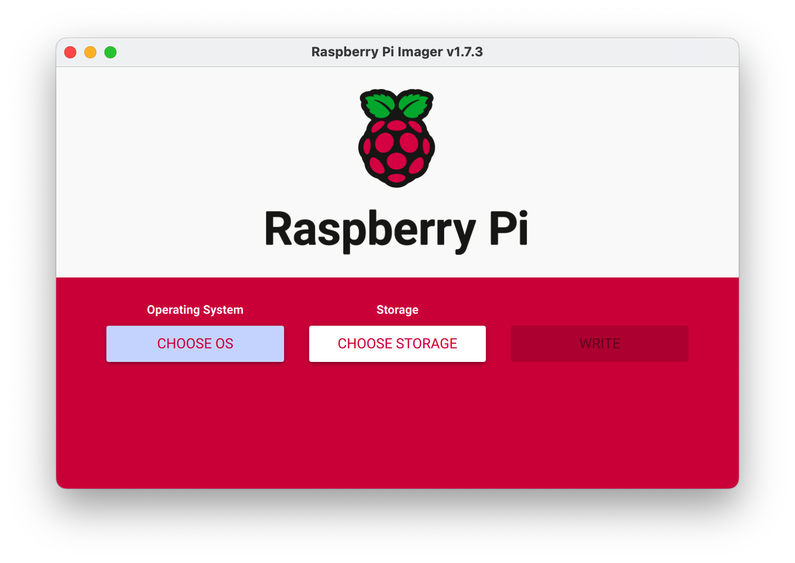

# How To Run GaGa On Raspberry Pi

>How to easily install a GaGaNode on Raspberry Pi.

[[toc]]

## Deploy Requirements

- Any [Raspberry Pi Products](https://www.raspberrypi.com/products/), Including Raspberry Pi 1 - 2, Raspberry Pi Zero 1 - 2
- Idle Home Broadband

## SetUp the Raspberry Pi

GaGaNode takes up a very small amount of space, does not affect previously running applications on the Raspberry Pi, and can be installed directly.

If the Raspberry Pi is brand new, you can use the [Raspberry Pi Imager](https://www.raspberrypi.com/software/) to install the Raspberry Pi OS.



Raspberry Pi Imager is a quick and easy way to install Raspberry Pi OS to a microSD card. Watch the [45-second video](https://www.youtube.com/watch?v=ntaXWS8Lk34) to learn how to install an operating system using Raspberry Pi Imager.

## Register

[https://dashboard.gaganode.com/register](https://dashboard.gaganode.com/register)


Click the button “[Install & Run](https://dashboard.gaganode.com/install_run)” and you can find out your token and installation tutorial in this page.


## 1.Download & Install

<CodeGroup>

  <CodeGroupItem title="Linux ARM 64-bit">

```bash
curl -o apphub-linux-arm64.tar.gz https://assets.coreservice.io/public/package/61/app-market-gaga-pro/1.0.4/app-market-gaga-pro-1_0_4.tar.gz&& tar -zxf apphub-linux-arm64.tar.gz && rm -f apphub-linux-arm64.tar.gz && cd ./apphub-linux-arm64 && sudo ./apphub service install
```

  </CodeGroupItem>

  <CodeGroupItem title="Linux ARM 32-bit">

```bash
curl -o apphub-linux-arm32.tar.gz https://assets.coreservice.io/public/package/72/app-market-gaga-pro/1.0.4/app-market-gaga-pro-1_0_4.tar.gz && tar -zxf apphub-linux-arm32.tar.gz && rm -f apphub-linux-arm32.tar.gz && cd ./apphub-linux-arm32 && sudo ./apphub service install
```

  </CodeGroupItem>

</CodeGroup>

## 2.Start Service

```bash
sudo ./apphub service start
```

## 3.Check APP Status

```bash
./apphub status
```

## 4.Set Token

```bash
sudo ./apps/gaganode/gaganode config set --token=`your token`
```

## 5.Restart APP

```bash
./apphub restart
```

## Commands Reference

```bash
sudo ./apphub service install                    # install node
sudo ./apphub service start                      # start node
sudo ./apphub service stop                       # stop node
sudo ./apphub service remove                     # remove node
./apphub status                                  # check node running status
./apphub restart                                 # restart node
./apphub upgrade                                 # upgrade node
./apphub log                                     # check logs
./apphub -h                                      # check help
```

## Terminal Rsecording

<a href="https://asciinema.org/a/545172" target="_blank"></a>