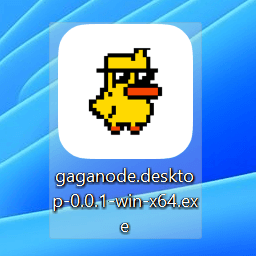
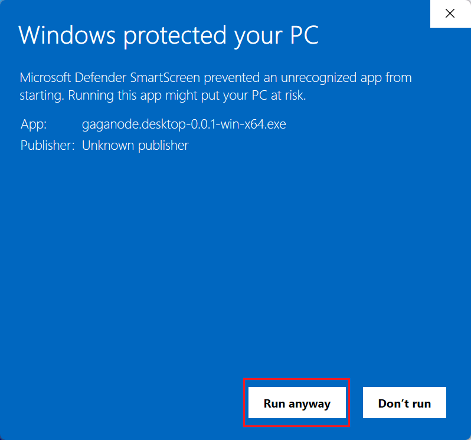
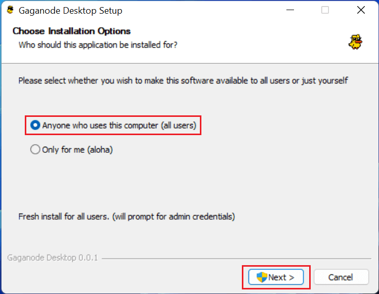
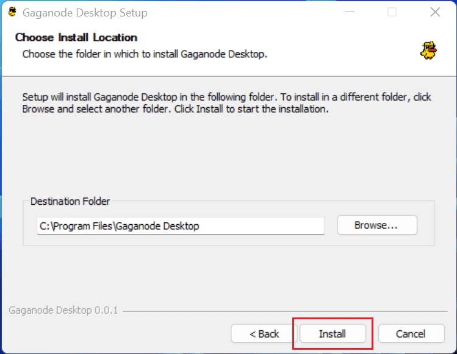
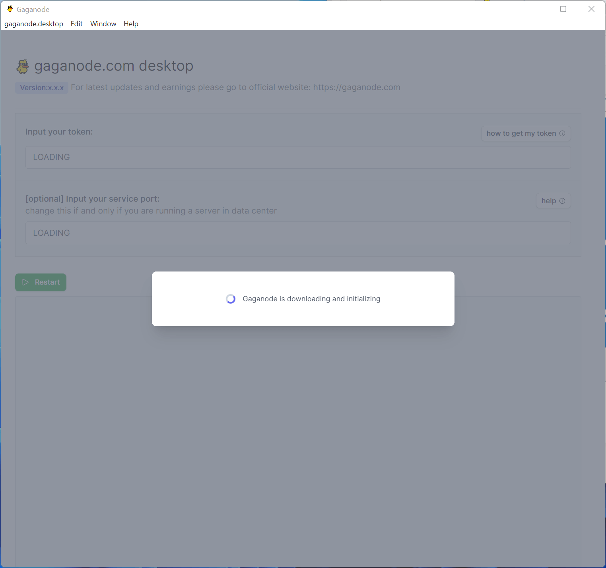
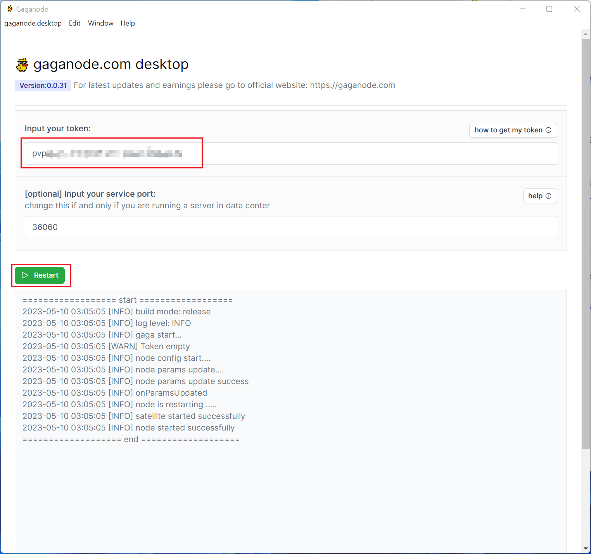
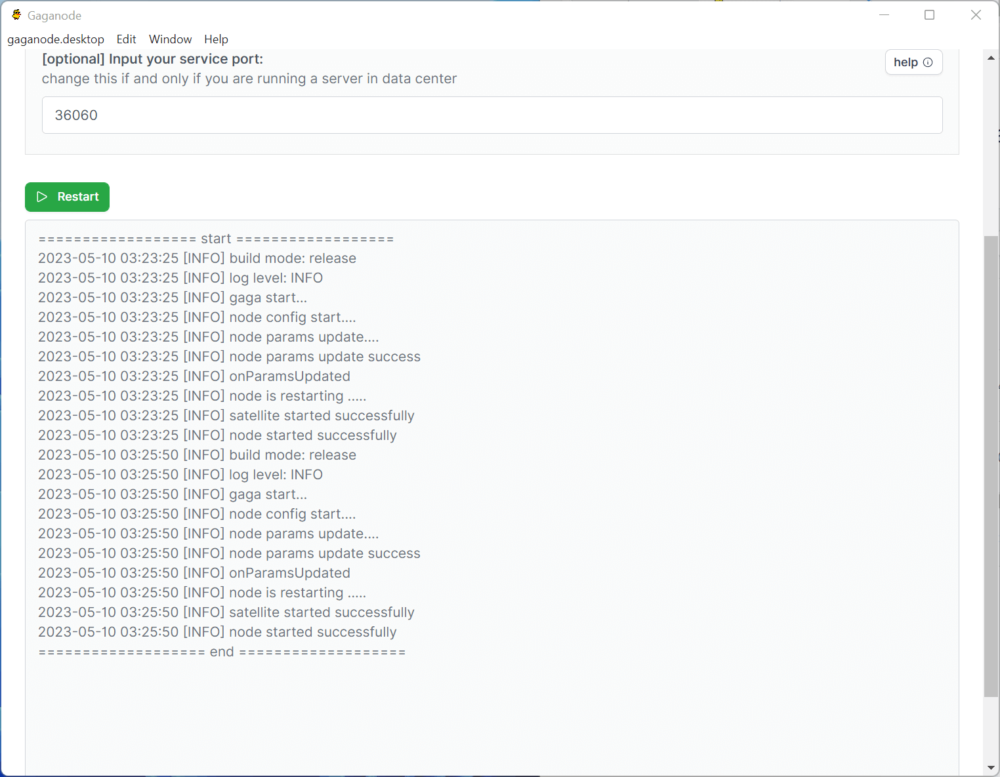
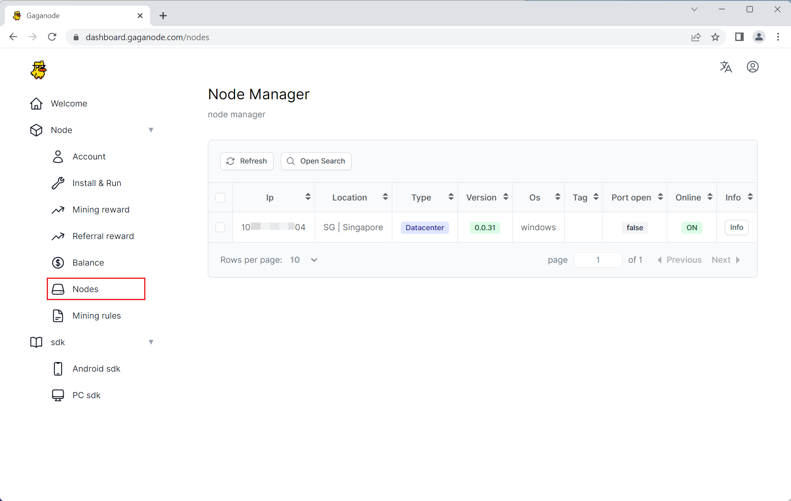

# Run GaGa On Windows Desktop

>How to easily install a GaGaNode on Windows.

[[toc]]

## 1.Download

You can obtain your token and installation package by clicking the "[Install & Run](https://dashboard.gaganode.com/install_run)" on this page.

You can obtain the installation package of Gaganode Pro by unzipping it.

## 2.Install 

To continue running Gaganode Desktop in "Windows Protected Your PC" dialog box, you need to click on "Run anyway".

To proceed with the installation, select "Anyone who uses this computer" and click on the "Next".

Select the installation path for Gaganode Desktop and complete the installation process.

## 3.Start Service

When you open GaGaNode Desktop, it will first initiate a download process for initialization, which may take anywhere between 1-3 minutes to complete.

Once the download is complete, enter your Gaganode token and click on the "Restart" to initiate the restart process.

After waiting for the restart process to complete, you will notice that Gaganode has been successfully launched.

After 1-3 minutes, you will have a new terminal record at terminals open in new node .

