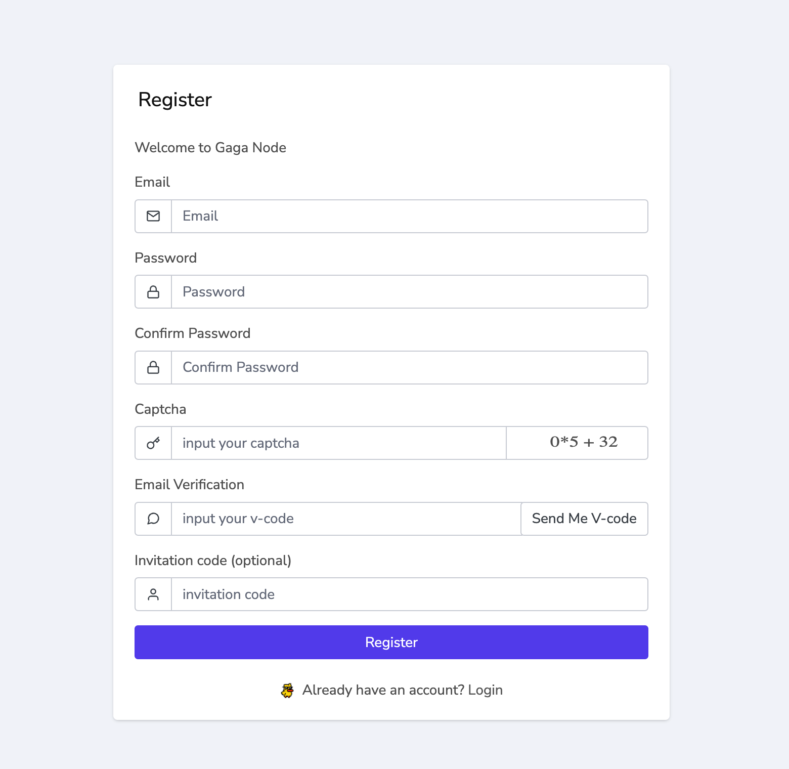
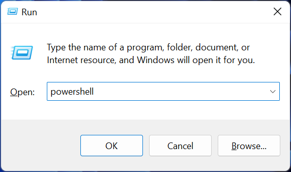
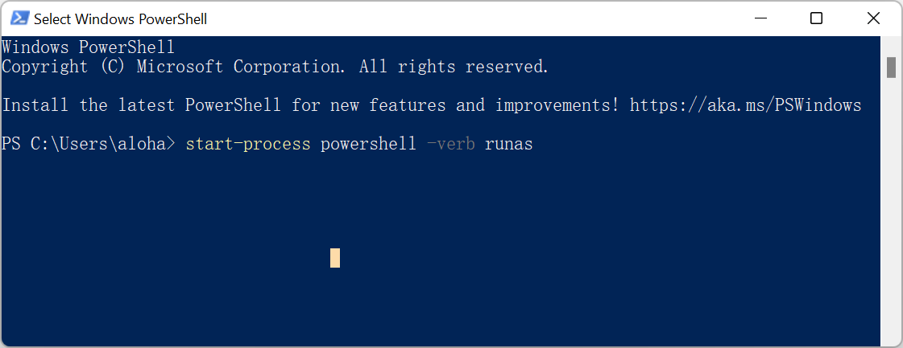
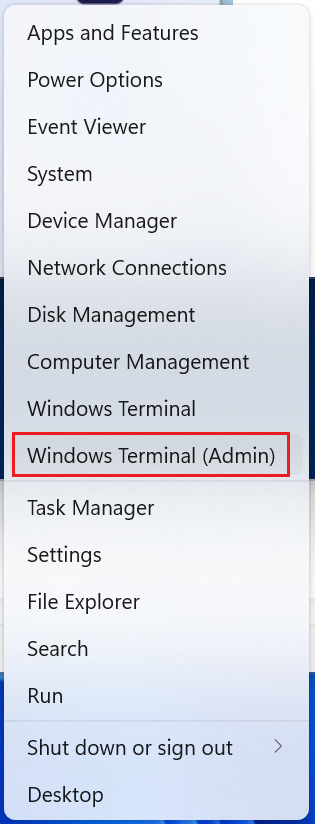
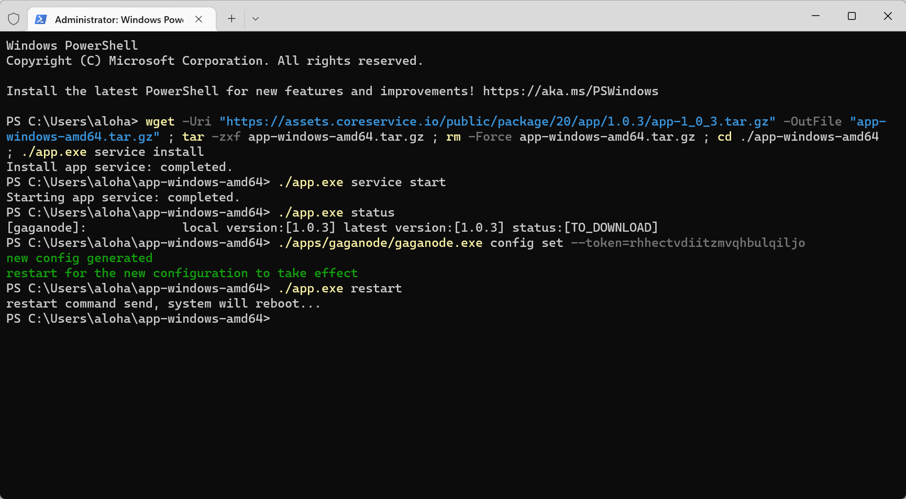
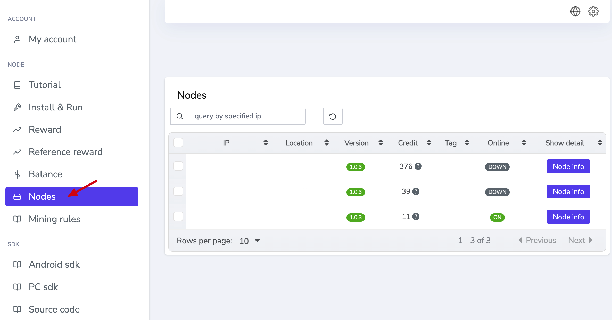

# How To Run GaGa On Windows

>How to easily install a GaGaNode on Windows.

[[toc]]

## Register

[https://dashboard.gaganode.com/register](https://dashboard.gaganode.com/register)



Click the button “[Install & Run](https://dashboard.gaganode.com/install_run)” and you can find out your token and installation tutorial in this page.


## Open PowerShell in Windows

### Use the “Run” window to open PowerShell

You can open Windows PowerShell with administrator privileges from Run. A quick way to launch this window is to press the `Win` + `R` keys on the keyboard. Then, type `powershell` and press Enter or click OK.

<div align="center">

</div>

Switch from PowerShell to PowerShell Admin. If you’re already working in PowerShell but you need to switch over to `admin` mode, you can do so without closing PowerShell. Just run this command:

```bash
start-process powershell -verb runas
```

<div align="center">

</div>

### Use the WinX Power User Menu to start PowerShell

You can also launch Windows PowerShell as an admin from the Windows Power User menu. To access the Power User menu, right-click the Start menu (Windows icon) in the bottom-left corner of the desktop. The Power User menu will appear. Here, click `Windows Terminal (Admin)` & `Windows PowerShell (Admin)`.

<div align="center">

</div>

## 1.Download & Install

<CodeGroup>

  <CodeGroupItem title="Windows 64-bit">

```bash
wget -Uri "https://assets.coreservice.io/public/package/20/app/1.0.3/app-1_0_3.tar.gz" -OutFile "app-windows-amd64.tar.gz" ; tar -zxf app-windows-amd64.tar.gz ; rm -Force app-windows-amd64.tar.gz ; cd ./app-windows-amd64 ; ./app.exe service install
```

  </CodeGroupItem>

  <CodeGroupItem title="Windows 32-bit">

```bash
wget -Uri "https://assets.coreservice.io/public/package/19/app/1.0.3/app-1_0_3.tar.gz" -OutFile "app-windows-386.tar.gz" ; tar -zxf app-windows-386.tar.gz ; rm -Force app-windows-386.tar.gz ; cd ./app-windows-386 ; ./app.exe service install
```

  </CodeGroupItem>

</CodeGroup>

console output:

```bash
PS C:\Users\Administrator> wget -Uri "https://assets.coreservice.io/public/package/20/app/1.0.3/app-1_0_3.tar.gz" -OutFile "app-windows-amd64.tar.gz" ; tar -zxf app-windows-amd64.tar.gz ; rm -Force app-windows-amd64.tar.gz ; cd ./app-windows-amd64 ; ./app.exe service install
Install app service: completed.
```

## 2.Start Service

```bash
./app.exe service start
```

console output:

```bash
PS C:\Users\Administrator\app-windows-amd64> ./app.exe service start
Starting app service: completed.
```


## 3.Check APP Status

```bash
./app.exe status
```

check gaganode status is RUNNING

Status List:

```bash
TO_DOWNLOAD                     # app to download
DOWNLOADED                      # app downloaded
INSTALLED                       # app installed
RUNNING                         # app running
```

console output:

```bash
PS C:\Users\Administrator\app-windows-amd64> ./app.exe status
[gaganode]:             local version:[1.0.3] latest version:[1.0.3] status:[TO_DOWNLOAD]
```

## 4.Set Token

```bash
./apps/gaganode/gaganode.exe config set --token=`your token`
```

console output:

```bash
PS C:\Users\Administrator\app-windows-amd64> ./apps/gaganode/gaganode.exe config set --token=rhhectvdiitzmvqhbulqiljo
new config generated
restart for the new configuration to take effect
```

## 5.Restart APP

```bash
./app.exe restart
```

console output:

```bash
PS C:\Users\Administrator\app-windows-amd64> ./app.exe restart
restart command send, system will reboot...
```




After 1-3 minutes, you will have a new terminal record at terminals open in new node .



## Commands Reference

```bash
./app.exe service install                    # install node
./app.exe service start                      # start node
./app.exe service stop                       # stop node
./app.exe service remove                     # remove node
./app.exe status                             # check node running status
./app.exe restart                            # restart node
./app.exe upgrade                            # upgrade node
./app.exe log                                # check logs
./app.exe -h                                 # check help
```